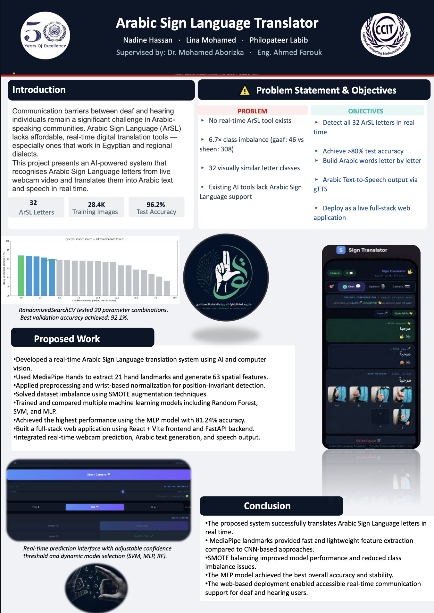
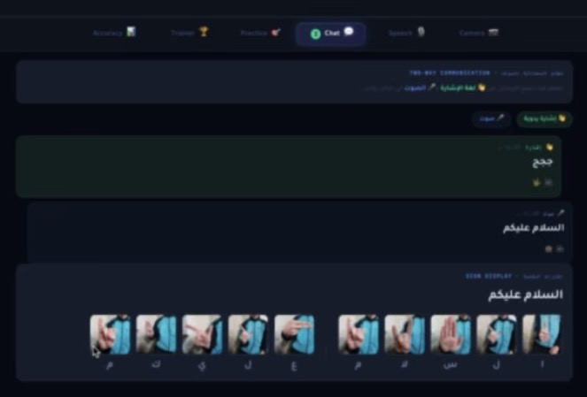
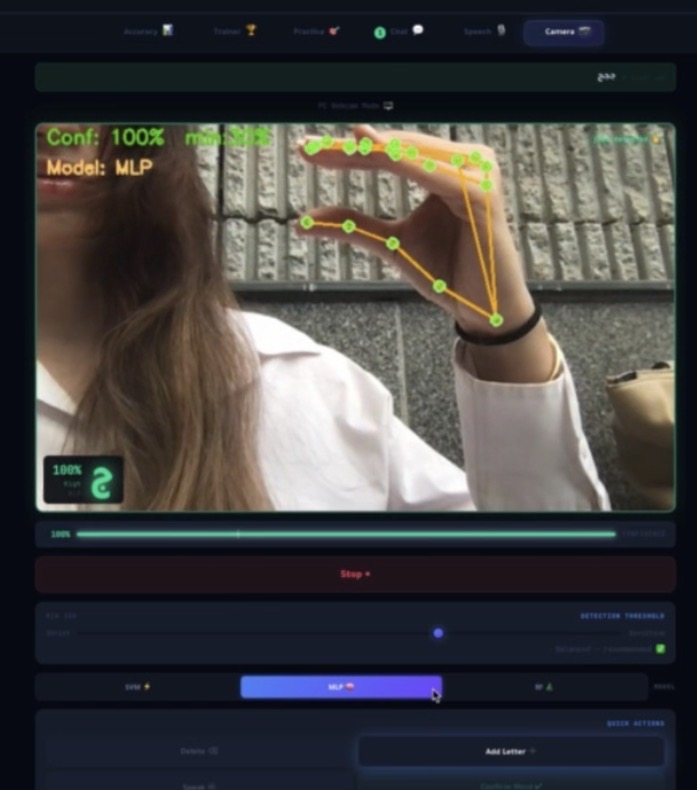
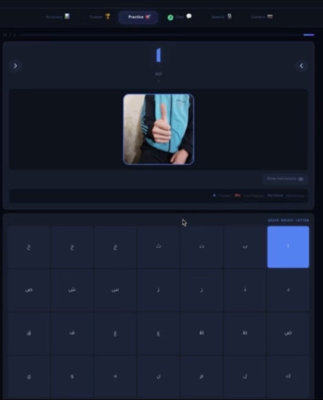

# 🤟 Arabic Sign Language Translator
### مترجم لغة الإشارة العربية بالذكاء الاصطناعي

> Real-time Arabic Sign Language detection and translation using AI


---
## Project Poster



---

## Demo 






---

## 📌 Project Overview
An AI-powered system that detects **32 Arabic Sign Language letters** from a live webcam and translates them into Arabic text and speech in real time.

Built for the **Advanced AI Course — Arab academy for science and technology, Week 13**

 
**Supervisors:** Dr. Mohamed Aborizka · Eng. Ahmed Farouk

---

## 🎯 Results

| Model | Accuracy | F1 Score |
|-------|----------|----------|
| Random Forest | 71.44% | 70.46% |
| **MLP Neural Network** ⭐ | **81.24%** | **78.12%** |
| SVM (RBF) | 74.20% | 73.90% |

---

## 🧠 How It Works
1. **MediaPipe Hands** detects 21 hand landmarks (x,y,z) = 63 features
2. **Normalize** relative to wrist — position invariant
3. **SMOTE** balances 6.7× class imbalance → +2.04% accuracy
4. **MLP Neural Network** (512→256→128) classifies the letter
5. **Majority vote** over 5 frames removes flickering
6. **FastAPI WebSocket** streams predictions to React frontend
7. **gTTS** speaks the Arabic letter/word aloud

---

## 🛠️ Tech Stack
- **ML:** scikit-learn, MediaPipe, SMOTE (imbalanced-learn)
- **Backend:** FastAPI, uvicorn, OpenCV, gTTS, Whisper
- **Frontend:** React, Vite, Recharts
- **Deployment:** ngrok public URL

---

## 🚀 How to Run

### Backend
```bash
conda activate signlang
cd sign_language_translator
pip install fastapi uvicorn opencv-python mediapipe scikit-learn gtts python-multipart
uvicorn app:app --reload --host 0.0.0.0 --port 8000
```

### Frontend
```bash
cd frontend
npm install
npm run dev
```

Open `http://localhost:5173`

---

## 📁 Project Structure
---

## 📊 Dataset
Arabic Sign Language Dataset 2022 — Kaggle (Ammar Sayed)  
28,400 images · 32 classes · YOLO format · CC BY-SA 4.0

*Note: Dataset not included in repo due to size (856MB). Download from [Kaggle](https://www.kaggle.com)*

---

## 📚 References
1. Sayed, A. (2022). Arabic Sign Language Dataset 2022. Kaggle.
2. Zhang, F. et al. (2020). MediaPipe Hands. arXiv:2006.10214.
3. Chawla, N.V. et al. (2002). SMOTE. JAIR 16, 321–357.
